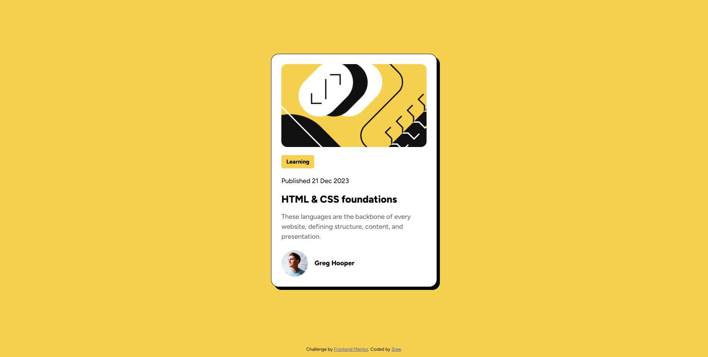

# Frontend Mentor - Blog preview card solution

This is my solution to the [Blog preview card challenge on Frontend Mentor](https://www.frontendmentor.io/challenges/blog-preview-card-ckPaj01IcS). It was a fun and focused way to practice semantic HTML, responsive design, and accessibility.

## Table of contents

- [Overview](#overview)
  - [The challenge](#the-challenge)
  - [Screenshot](#screenshot)
  - [Links](#links)
- [My process](#my-process)
  - [Built with](#built-with)
  - [What I learned](#what-i-learned)
  - [Continued development](#continued-development)
- [Author](#author)

## Overview

### The challenge

Users should be able to:

- View the blog card layout on mobile and desktop
- See hover states for all interactive elements

### Screenshot



### Links

- Solution URL: [Frontend Mentor](https://www.frontendmentor.io/solutions/)
- Live Site URL: [Live Demo](https://imissh3r.github.io/blog-preview-card/)

## My process

### Built with

- Semantic HTML5
- CSS Flexbox
- Mobile-first workflow
- Custom properties (CSS variables)
- [Figtree font](https://fonts.google.com/specimen/Figtree)

### What I learned

This project helped reinforce best practices like:

```html
<!-- Using aria-label for accessibility -->
<a href="#" aria-label="Open HTML & CSS blog">HTML & CSS foundations</a>
```
```css
/* Clean hover effects */
#title-txt a:hover {
  color: hsl(47, 88%, 63%);
  cursor: pointer;
}
```

## Author

- Github - [@Imissh3r](https://github.com/Imissh3r)
- Frontend Mentor - [@Imissh3r](https://www.frontendmentor.io/profile/Imissh3r)
